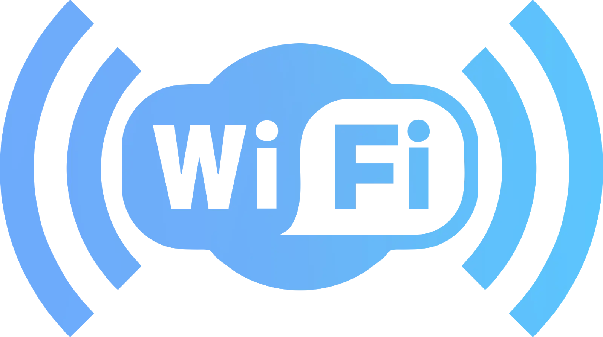
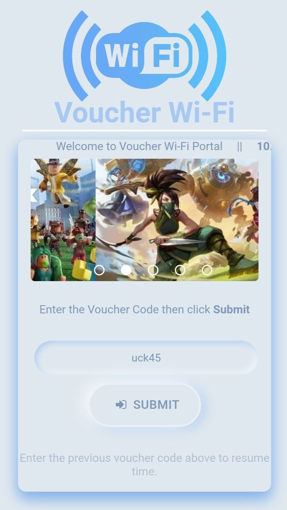
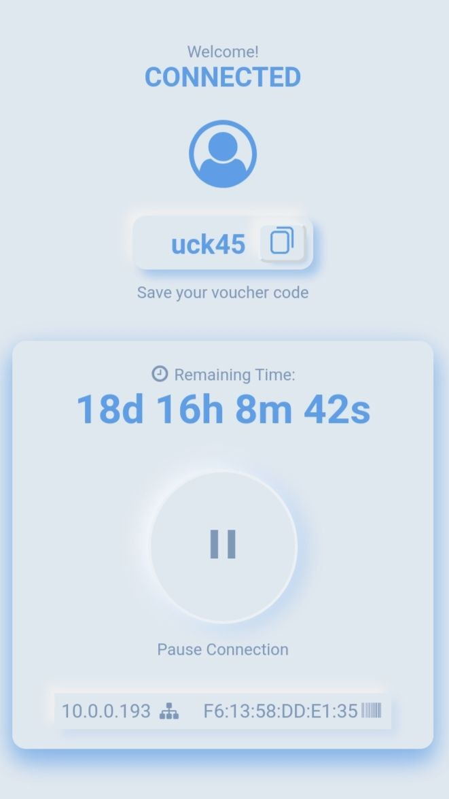
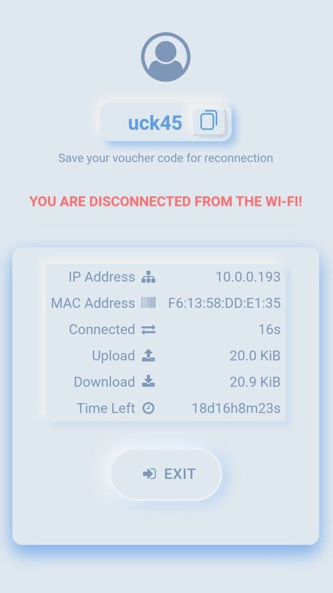

  

<h1 align="center">Customized MikroTik Hotspot Portal Design (Mikhmon)</h1>

Welcome to the MikroTik Hotspot Portal repository! This project is designed to enhance the user experience of MikroTik Hotspot users by providing a customized and visually appealing portal for authentication.

## Features:
1. **Customized Design:** The portal includes HTML, CSS, and JavaScript files that have been carefully crafted to provide an attractive and user-friendly interface.

2. **Easy Integration:** The files are designed for seamless integration with MikroTik Hotspot systems. Simply replace the default files with the customized ones to personalize your Hotspot portal.

## Sample Images

Here are some sample images from the portal:

        
        
        

## How to Use:
1. **Download:** Clone or download the repository to your computer where [Winbox](https://mikrotik.com/download) is installed.

2. **Customize:** Modify the HTML, CSS, and JavaScript files according to your branding and design preferences. *Skip to Step 3 if no further modifications are desired.*

3. **Upload to MikroTik:** Replace the default files on your MikroTik Hotspot server with the downloaded files.
   
4. **Enjoy:** Users connecting to your MikroTik Hotspot will now experience the enhanced portal with the custom design.

## Contribution:
Contributions and improvements are welcome! If you have ideas for enhancements, bug fixes, or additional features, feel free to fork the repository and submit pull requests.

*I hope this customized MikroTik Hotspot Portal enhances the user experience on your network. Happy coding!*

*Feel free to donate in my [Ko-fi](https://ko-fi.com/domxii) or GCash number 09071945418. For donations outside the Philippines you can send in my [PayPal](https://www.paypal.com/paypalme/Domoxi). Your support is greatly appreciated. Thank you!*
